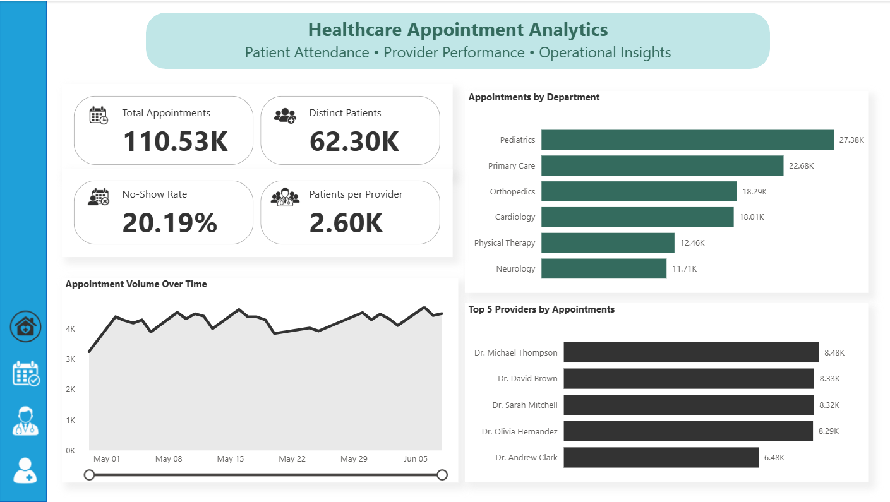
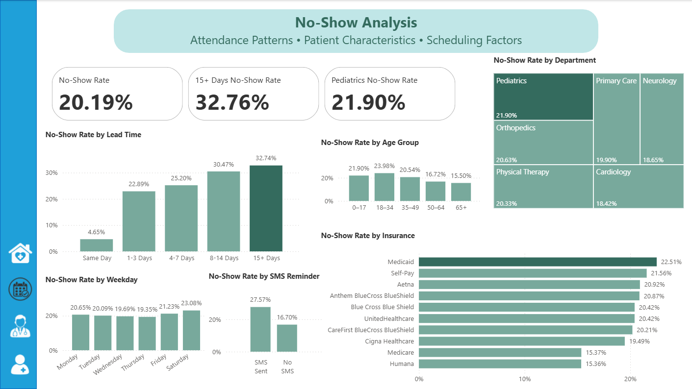
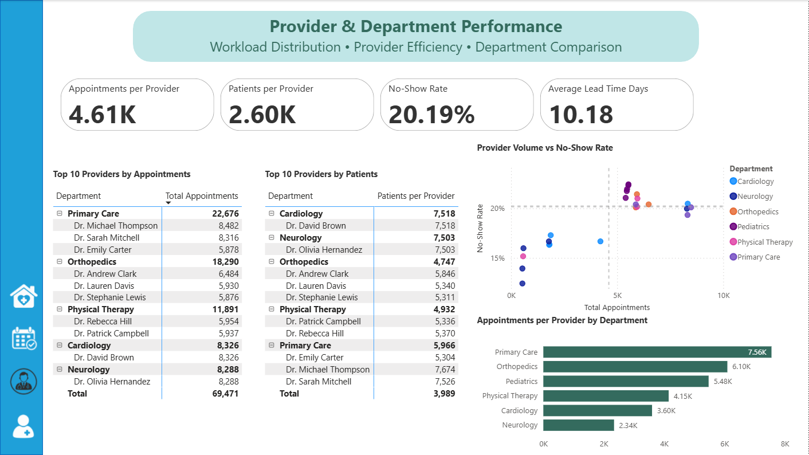
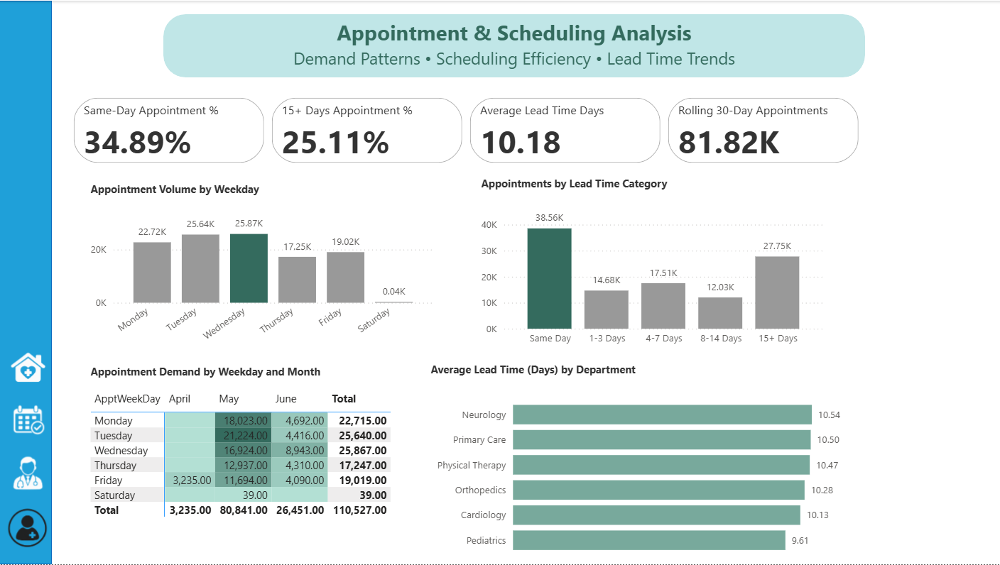
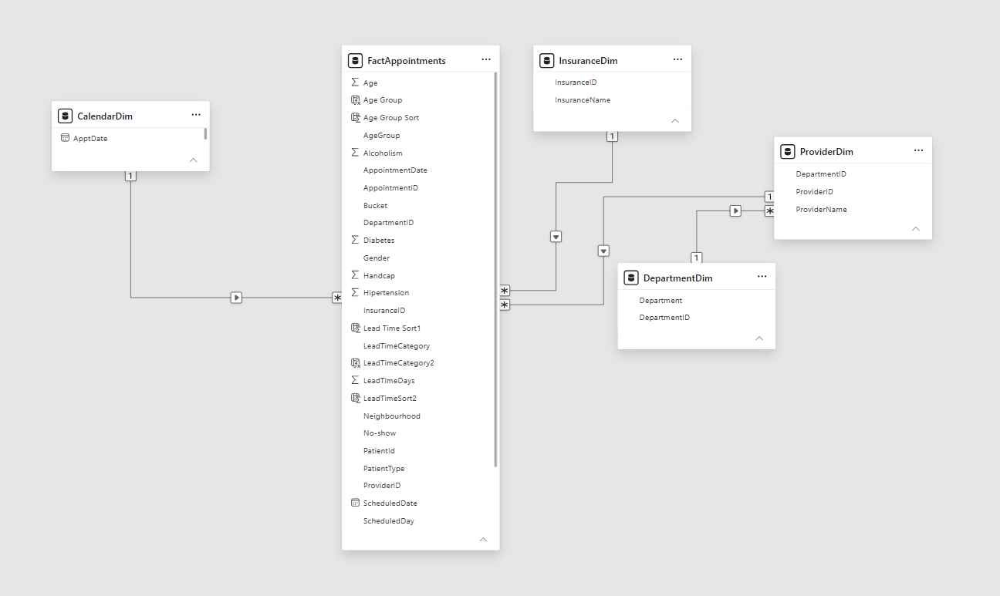

# healthcare-appointment-analytics
Power BI healthcare analytics dashboard exploring appointment volume, no-shows, provider performance, and scheduling efficiency. 

**Business question:** 
How can a clinic reduce missed appointments, improve provider utilization, and better understand patient demand?

## Dashboard

### Executive Overview



This page provides a **quick overview of appointment activity across the healthcare organization.** It summarizes key performance indicators and highlights **appointment volume over time, department workload, and top providers.** This page is designed to give users a quick snapshot of overall appointment operations.

### No-Show Analysis



This page focuses on **patient attendance and no-show behavior.** It highlights differences in no-show rates across **patient demographics, scheduling lead times, departments, insurance types, weekdays, and SMS reminders**, providing insight into the factors associated with missed appointments.

Key Findings

**Scheduling lead time shows the strongest relationship with no-show rates.** Same-day appointments have the lowest no-show rate at **4.65%,** while appointments scheduled **15+ days in advance reach 32.74%.** This suggests that longer waiting periods are strongly associated with a higher likelihood of missed appointments.
Younger adults (18–34) and Pediatrics also show relatively higher no-show rates, indicating potential areas for targeted attendance strategies.
The SMS comparison shows **27.57% for appointments with an SMS recorded versus 16.70% without SMS.** This should be described as an **association rather than evidence that SMS reminders increase no-shows,** since reminders may be sent selectively or depend on scheduling characteristics.

### Provider & Department Performance



This page examines **workload and performance across providers and departments,** showing how **appointments and patients are distributed** and how provider volume relates to **no-show rates.**

Key Findings

**Primary Care has the highest appointment workload per provider (7.56K), while Neurology has the lowest (2.34K).** The provider-level analysis also shows that **higher appointment volume does not necessarily correspond to higher no-show rates, ** highlighting differences in performance and workload across providers and departments.

### Appointment & Scheduling Analysis



This page explores **appointment demand and scheduling patterns,** focusing on **when appointments occur, how far in advance they are scheduled, and how lead times vary across departments.**

Key Findings

**Same-day appointments represent the largest scheduling group (34.89%),** while **25.11% are scheduled 15+ days in advance.** Appointment demand is highest on **Wednesday,** and average lead time remains relatively consistent across departments at approximately **10 days.**

## Key Insights

*	**Pediatrics had the highest appointment volume,** with approximately **27.4K appointments,** making it the busiest department in the dataset.
*	The overall **no-show rate was 20.19%.** No-shows were highest in **Pediatrics (21.90%),** while scheduling lead time showed an especially strong pattern: appointments booked **15+ days in advance had a 32.74% no-show rate,** compared with only **4.65% for same-day appointments.**
*	Attendance also varied by **weekday and insurance type. Saturday had the highest no-show rate (23.08%).** Among insurance groups, **Medicaid had the highest rate (22.51%),** while **Medicare (15.37%) and Humana (15.36%)** had the lowest.
*	An unexpected pattern appeared in the **SMS reminder analysis:** appointments with an SMS reminder had a** 27.57% no-show rate,** compared with **16.70% without an SMS.** This should **not be interpreted as evidence that SMS reminders cause more no-shows;** other factors, such as which patients or appointments received reminders, may explain the difference.
*	**Primary Care showed the highest appointment workload per provider (7.56K).** The provider volume vs. no-show analysis suggests that **higher provider volume was not consistently associated with higher no-show rates** —some of the highest-volume providers maintained no-show rates around or below the overall average.
*	**Wednesday was the busiest day,** with approximately **25.9K appointments,** and **same-day appointments were the most common scheduling category,** accounting for **34.89% of all appointments.

## Data Model

The project uses a **star schema,** with FactAppointments as the central fact table connected to four dimensional tables.


* **FactAppointments** — The original appointment dataset was obtained from **Kaggle.** The data was reviewed, cleaned, formatted, and supplemented with additional fields required for the analysis. It contains the main appointment-level information and serves as the core table of the data model.
* **CalendarDim** — Created from appointment dates and supplemented with date-related attributes such as **day, weekday, month, and month number** to support time-based analysis, sorting, and visualizations.
* **DepartmentDim** — Contains **Department ID and Department Name,** allowing appointment activity and performance to be analyzed across departments.
* **InsuranceDim** — Contains **Insurance ID and Insurance Name,** enabling comparison of appointment and no-show patterns across insurance providers.
* **ProviderDim** — Contains **Provider ID and Provider Name,** supporting provider-level analysis of appointment volume, patient workload, and no-show performance. 

The dimensional tables were added to create a more structured and scalable data model and to support clearer relationships and analysis in Power BI.


## **Business Recommendations**

Based on the dashboard analysis, the clinic could take several actions to address the original business question:
* **Reduce missed appointments:** Focus attendance interventions on appointments scheduled far in advance. The no-show rate rises from **4.65% for same-day appointments to 32.74% for appointments scheduled 15+ days ahead,** suggesting that long lead-time appointments are the strongest candidates for additional confirmation or follow-up closer to the appointment date. Higher-risk groups, such as younger adults and Saturday appointments, could also receive targeted attention. 
* **Reassess the SMS reminder strategy:** Appointments with recorded SMS reminders showed a higher no-show rate than those without reminders (**27.57% vs. 16.70%**). This does not demonstrate that SMS reminders cause no-shows, but it suggests that the clinic should investigate **who receives reminders, when they are sent, and whether reminders are being targeted toward appointments already at higher risk of being missed.**
* **Improve provider utilization:** Workload varies considerably across departments, with **Primary Care showing the highest appointments per provider.** Comparing appointment volume with provider no-show rates can help identify high-volume providers and departments where workload balancing or additional capacity may be beneficial.
* **Align capacity with patient demand: Wednesday is the busiest appointment day,** while same-day appointments are the most common scheduling category (**34.89% of appointments**). Staffing and appointment availability could therefore be aligned with these demand patterns, with greater capacity allocated to the busiest periods.

**Conclusion**

The analysis suggests that the clinic could improve operations by **prioritizing long lead-time appointments for attendance interventions, evaluating its reminder strategy, balancing provider workload, and aligning staffing and scheduling capacity with observed patient demand.** These actions could help reduce missed appointments while improving the use of available clinical resources.


## Selected DAX Measures

### Total Appointments

```DAX
Total Appointments = 
COUNTROWS(FactAppointments)
```

### Distinct Patients

```DAX
Distinct Patients = 
DISTINCTCOUNT(FactAppointments[PatientId])
```

### No-Show Rate

```DAX
No-Show Rate = 
DIVIDE(
    [No Show Count],
    [Total Appointments],
    0
)
```

### 15+ Days No-Show Rate

```DAX
15+ Days No-Show Rate = 
CALCULATE(
    [No-Show Rate],
    FactAppointments[LeadTimeCategory] = "15+ Days"
)
```

### Patients per Provider

```DAX
Patients per Provider = 
DIVIDE(
    [Distinct Patients],
    DISTINCTCOUNT(FactAppointments[ProviderID]),
    0
)
```

[View all DAX measures](dax/measures.md)

## Tools & Skills

Power BI | Power Query | DAX | Data Modeling |
Data Visualization | Dashboard Design

## Data Source

The original dataset was obtained from Kaggle – Medical Appointment No Shows (https://www.kaggle.com/datasets/joniarroba/noshowappointments). It contains **110,527 medical appointment records and 14 associated variables,** including patient demographics, appointment details, and attendance information.
The original data was **reviewed, cleaned, and formatted** before analysis. **Provider, department, and insurance dimensions were synthetically created** for portfolio and analytical purposes to support a more comprehensive Power BI data model and additional business-focused analysis.

## Notes

Interactive report: This project was developed in Power BI Desktop. A public interactive version is not available.


